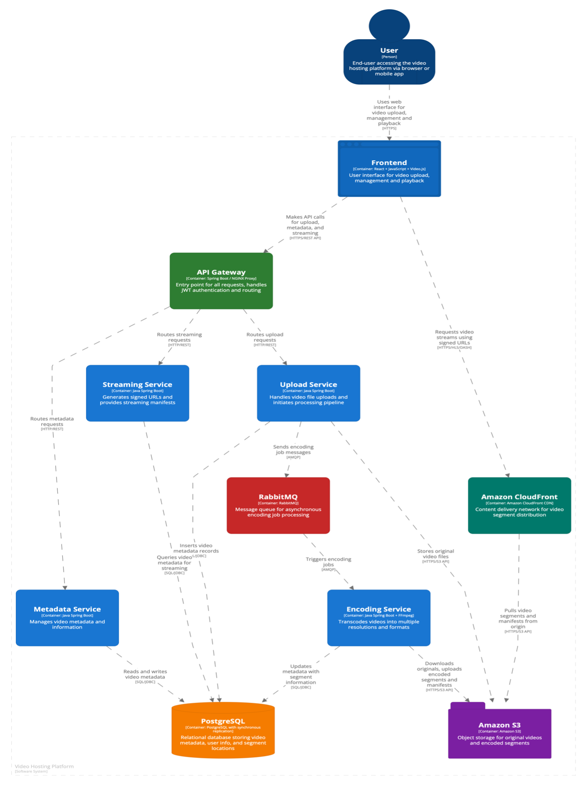
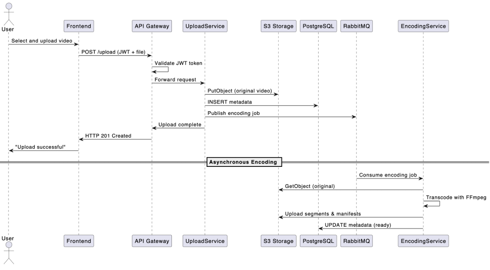
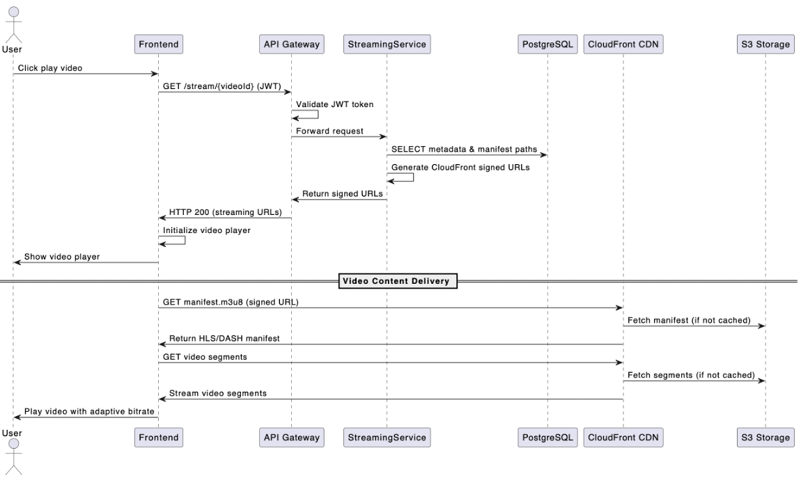

# Video Hosting Platform

A distributed microservices-based platform for video upload, transcoding, storage, and adaptive streaming. Built with Spring Boot, AWS S3, CloudFront, and PostgreSQL, this platform provides enterprise-grade video hosting capabilities with features like multi-quality encoding, adaptive streaming, and global content delivery.

## 🏗 Architecture

### Figure 1 – Component Diagram of the Distributed Video Hosting Platform


### Figure 2 – Sequence Diagram: Video Upload Flow


### Figure 3 – Sequence Diagram: Video Streaming Flow


### Figure 4 - High-Level Architecture 

```
┌─────────────────────────────────────────────────────────────────────────────────────────────────┐
│                                  Video Hosting Platform                                         │
├─────────────────────────────────────────────────────────────────────────────────────────────────┤
│  PRESENTATION LAYER                                                                             │
│  ┌─────────────────────────────────────────────────────────────────────────────────────────┐    │
│  │                           React Frontend (Port: 3000)                                   │    │
│  │                      OAuth2 PKCE | Material-UI | HLS Video Player                       │    │
│  └─────────────────────────────────────────────────────────────────────────────────────────┘    │
│                                         │                                                       │
├─────────────────────────────────────────┼───────────────────────────────────────────────────────┤
│  API LAYER                              │                                                       │
│  ┌─────────────────────────────────────────────────────────────────────────────────────────┐    │
│  │                            API Gateway (Port: 8080)                                     │    │
│  │         JWT Authentication | CORS | Request Routing | Load Balancing                    │    │
│  └─────────────────────────────────────────────────────────────────────────────────────────┘    │
│         │              │                │                │                │                     │
├─────────┼──────────────┼────────────────┼────────────────┼────────────────┼─────────────────────┤
│  MICROSERVICES LAYER   │                │                │                │                     │
│  ┌─────────────┐  ┌─────────────┐  ┌─────────────┐  ┌─────────────┐  ┌──────────────┐           │
│  │    Auth     │  │   Upload    │  │  Metadata   │  │  Streaming  │  │  Encoding    │           │
│  │ Port: 8081  │  │ Port: 8082  │  │ Port: 8083  │  │ Port: 8084  │  │ Port: 8085   │           │
│  │             │  │             │  │             │  │             │  │              │           │
│  │ OAuth2/JWT  │  │ S3 Upload   │  │ Search &    │  │ HLS/DASH    │  │ Multi-Quality│           │
│  │ Google SSO  │  │ Multipart   │  │ Analytics   │  │ Streaming   │  │ Transcoding  │           │
│  │ User Mgmt   │  │ Validation  │  │ CDN URLs    │  │ Sessions    │  │ FFmpeg       │           │
│  └─────────────┘  └─────────────┘  └─────────────┘  └─────────────┘  └──────────────┘           │
│         │                │                │                │                │                   │
├─────────┼────────────────┼────────────────┼────────────────┼────────────────┼───────────────────┤
│  SHARED INFRASTRUCTURE & DATABASES        │                │                │                   │
│         │                │                │                │                │                   │
│  ┌─────────────┐  ┌────────────────────────────────────────────────────────────────────────┐    │
│  │ PostgreSQL  │  │                 PostgreSQL Video DB (Master-Slave)                     │    │
│  │  Auth DB    │  │                      HAProxy Load Balancer                             │    │
│  │ Port: 5432  │  │  Master: 5433 (writes) | Slave: 5434 (reads)                           │    │
│  │             │  │  HAProxy Write: 5435 | HAProxy Read: 5436                              │    │
│  │ Users       │  │                                                                        │    │
│  │ Sessions    │  │ • videos • encoding_jobs • view_sessions                               │    │
│  │ Permissions │  │ • user_roles • roles • permissions                                     │    │
│  └─────────────┘  └────────────────────────────────────────────────────────────────────────┘    │
│                          │                │                │                │                   │
│  ┌─────────────────────────────────────────────────────────────────────────────────────────┐    │
│  │                           Redis Cache (Port: 6379)                                      │    │
│  │    • User sessions • Upload sessions • Metadata cache • JWT blacklist                   │    │
│  └─────────────────────────────────────────────────────────────────────────────────────────┘    │
│                          │                │                │                │                   │
│  ┌─────────────────────────────────────────────────────────────────────────────────────────┐    │
│  │                      RabbitMQ Message Broker (Port: 5672)                               │    │
│  │    • Video upload events • Encoding jobs • Processing completion • Analytics events     │    │
│  └─────────────────────────────────────────────────────────────────────────────────────────┘    │
│                          │                │                │                │                   │
│  ┌─────────────────────────────────────────────────────────────────────────────────────────┐    │
│  │                      AWS S3 Storage + CloudFront CDN                                    │    │
│  │  • Original videos • Encoded HLS segments • Thumbnails • Global content delivery        │    │
│  └─────────────────────────────────────────────────────────────────────────────────────────┘    │
└─────────────────────────────────────────────────────────────────────────────────────────────────┘
```

## 🎯 Microservices

### Core Services
- **🌐 Gateway** (`gateway/`) - API Gateway with authentication and CORS handling
- **🔐 Authentication** (`authentication/`) - User authentication and authorization

### Video Processing Services
- **📤 Upload Service** (`upload/`) - Video file upload and storage (S3) with enterprise reliability features
- **📊 Metadata Service** (`metadata/`) - Video metadata, search, analytics, and user interactions
- **🎬 Encoding Service** (`encoding/`) - Video transcoding to multiple qualities (480p, 720p, 1080p)
- **🎥 Streaming Service** (`streaming/`) - Video streaming and delivery

## 🚀 Quick Start

### Prerequisites
- Java 21+
- Docker & Docker Compose
- Gradle 8+
- Node.js 18+ (for frontend)

### 1. Clone and Setup
```bash
git clone https://github.com/Ka1zerov/Video-Hosting-Platform.git
cd Video-Hosting-Platform
```

### 2. Environment Setup
Create `.env` files in each service directory with required variables (see [Environment Variables](#environment-variables) section).

### 3. Start Infrastructure
```bash
./platform.sh start full
```
For additional commands use:
```bash
./platform.sh
```

### 4. Start Services
```bash
# Terminal 1 - Upload Service
cd upload && ./gradlew bootRun

# Terminal 2 - Metadata Service
cd metadata && ./gradlew bootRun

# Terminal 3 - Encoding Service
cd encoding && ./gradlew bootRun

# Terminal 4 - Streaming Service
cd streaming && ./gradlew bootRun

# Terminal 5 - Gateway
cd gateway && ./gradlew bootRun

# Terminal 6 - Auth Service
cd authentication && ./gradlew bootRun
```

### 5. Access the Platform
- **API Gateway**: http://localhost:8080
- **Frontend**: http://localhost:3000
- **Admin Tools**: 
  - RabbitMQ UI: http://localhost:15672 (guest/guest)
  - Video DB Admin: http://localhost:5051 (admin@video.local/admin)
  - Redis Commander: http://localhost:8081

## 📁 Repository Structure

```
Video-Hosting-Platform/
├── infrastructure/          # Shared infrastructure (Docker, configs)
├── gateway/                 # API Gateway service
├── authentication/          # Authentication service  
├── upload/                  # Video upload service
├── metadata/               # Video metadata service
├── encoding/               # Video encoding service
├── streaming/              # Video streaming service
├── frontend/              # React frontend application
├── docs/                  # Documentation and diagrams
└── README.md              # This file
```

## 🔧 Environment Variables

### Required Variables
```env
# AWS Configuration
AWS_ACCESS_KEY=your_aws_access_key
AWS_SECRET_KEY=your_aws_secret_key
AWS_REGION=eu-north-1
S3_BUCKET_NAME=video-hosting-platform-bucket
S3_BUCKET_PREFIX=videos/
CLOUDFRONT_DOMAIN=xxxxxxx.cloudfront.net

# Google OAuth2
GOOGLE_CLIENT_ID=your_google_client_id
GOOGLE_CLIENT_SECRET=your_google_client_secret

# Database Configuration
DB_USERNAME=app_user
DB_PASSWORD=app_pass

# Redis Configuration
REDIS_HOST=localhost
REDIS_PORT=6379
REDIS_PASSWORD=

# RabbitMQ Configuration
RABBITMQ_HOST=localhost
RABBITMQ_PORT=5672
RABBITMQ_USERNAME=guest
RABBITMQ_PASSWORD=guest
```

For complete environment variable documentation, see [Environment Variables Setup](#environment-variables-setup).

## 📚 Documentation

### Service Documentation
- [Infrastructure Setup](infrastructure/README.md)
- [Upload Service](upload/README.md)
- [Metadata Service](metadata/README.md)
- [Streaming Service](streaming/README.md)
- [Encoding Service](encoding/README.md)
- [Authentication Service](authentication/README.md)
- [Gateway Service](gateway/README.md)

### Full Platform Documentation
For in-depth documentation of each service, data model, and bucket structure, see:
[Full Platform Documentation](./full_platform_documentation.md)

## 👨‍💻 Developer Notes

### Video Upload Flow
1. Upload video through the frontend or API
2. Upload service stores original in S3
3. Encoding service processes video asynchronously
4. Multiple quality versions are generated
5. Metadata is updated with video information

### Video Streaming
- Access streaming endpoints through the API Gateway
- HLS/DASH manifests are generated dynamically
- CloudFront CDN is used for global delivery
- Adaptive bitrate streaming is supported

### Monitoring & Debugging
- Service health checks: `/actuator/health`
- Logs: `logs/` directory in each service
- RabbitMQ UI: http://localhost:15672
- Database Admin: http://localhost:5051

### Testing
```bash
# Run all tests
./gradlew test

# Run specific service tests
cd upload && ./gradlew test
```

## 🔒 Security Notes

- Never commit `.env` files to version control
- Use strong, unique passwords for all services
- Regularly rotate AWS and Google credentials
- Keep CloudFront private keys secure
- Use different credentials for development and production

## 📄 License

This project is licensed under the Apache License, Version 2.0 (January 2004).  
See the [LICENSE](LICENSE) file for full license text.

© 2025 Tymofii Skrypko  
Contact: tymofiiskrypko@gmail.com

---

**Note**: This platform is designed for educational purposes as part of a Master's thesis. For production use, additional security, monitoring, and deployment considerations would be required.

## Environment Variables Setup

This project requires several environment variables to be set up for proper functioning. Create a `.env` file in the root directory of each service with the following variables:

### Authentication Service
```env
# Google OAuth2 Configuration
GOOGLE_CLIENT_ID=your_google_client_id
GOOGLE_CLIENT_SECRET=your_google_client_secret

# Database Configuration
DB_USERNAME=app_user
DB_PASSWORD=app_pass
```

### Upload Service
```env
# AWS Configuration
AWS_ACCESS_KEY=your_aws_access_key
AWS_SECRET_KEY=your_aws_secret_key
AWS_REGION=chosen_region
S3_BUCKET_NAME=video-hosting-thesis
S3_BUCKET_PREFIX=videos/

# Database Configuration
DB_USERNAME=upload_user
DB_PASSWORD=upload_pass

# Redis Configuration
REDIS_HOST=localhost
REDIS_PORT=6379
REDIS_PASSWORD=

# RabbitMQ Configuration
RABBITMQ_HOST=localhost
RABBITMQ_PORT=5672
RABBITMQ_USERNAME=guest
RABBITMQ_PASSWORD=guest
RABBITMQ_VHOST=/
RABBITMQ_EXCHANGE=video.exchange
RABBITMQ_QUEUE_ENCODING=video.encoding.queue
RABBITMQ_ROUTING_KEY_ENCODING=video.encoding

```

### Streaming Service
```env
# AWS Configuration
AWS_ACCESS_KEY=your_aws_access_key
AWS_SECRET_KEY=your_aws_secret_key
AWS_REGION=eu-north-1
S3_BUCKET_NAME=video-hosting-thesis
S3_BUCKET_PREFIX=videos/

# CloudFront Configuration
CLOUDFRONT_DOMAIN=your_cloudfront_domain
CLOUDFRONT_ENABLED=true
CLOUDFRONT_SIGNING_ENABLED=true
CLOUDFRONT_KEY_PAIR_ID=your_key_pair_id
CLOUDFRONT_PRIVATE_KEY_PATH=path_to_private_key
CLOUDFRONT_DEFAULT_EXPIRATION=2

# Database Configuration
DB_USERNAME=upload_user
DB_PASSWORD=upload_pass

# Redis Configuration
REDIS_HOST=localhost
REDIS_PORT=6379
REDIS_PASSWORD=

# CDN Configuration
CDN_ENABLED=false

# CORS Configuration
CORS_ALLOWED_ORIGINS=http://localhost:3000,http://localhost:8080
CORS_ALLOWED_METHODS=GET,POST,PUT,DELETE,OPTIONS
CORS_ALLOWED_HEADERS=*
```

### How to Obtain Required Credentials

1. **Google OAuth2 Credentials**:
   - Go to [Google Cloud Console](https://console.cloud.google.com)
   - Create a new project or select an existing one
   - Enable Google OAuth2 API
   - Create OAuth2 credentials
   - Copy Client ID and Client Secret

2. **AWS Credentials**:
   - Go to [AWS Console](https://console.aws.amazon.com)
   - Create an IAM user with appropriate permissions (S3, CloudFront)
   - Generate access key and secret key
   - Create an S3 bucket for video storage
   - Set up CloudFront distribution if needed

3. **CloudFront Setup**:
   - Create a CloudFront distribution pointing to your S3 bucket
   - Generate a key pair for signed URLs
   - Download the private key and store it securely
   - Note down the CloudFront domain and key pair ID

### Security Notes

- Never commit `.env` files to version control
- Use strong, unique passwords for all services
- Regularly rotate AWS and Google credentials
- Keep CloudFront private keys secure
- Use different credentials for development and production environments
